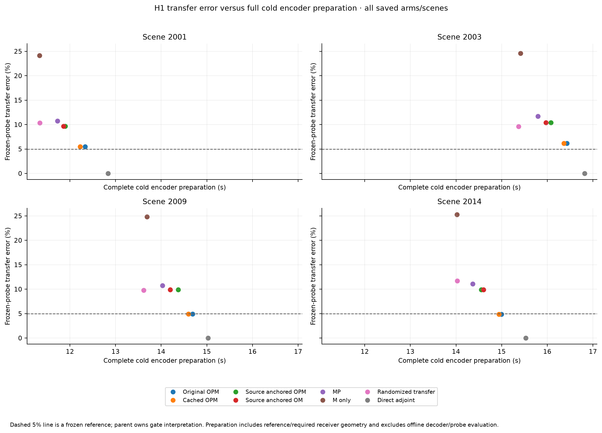
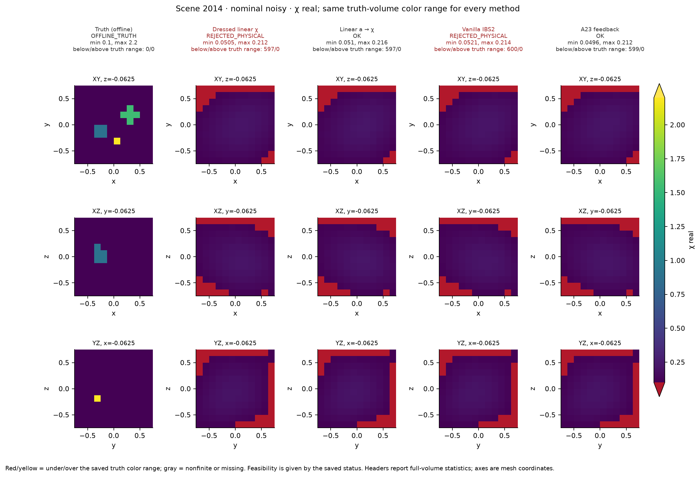
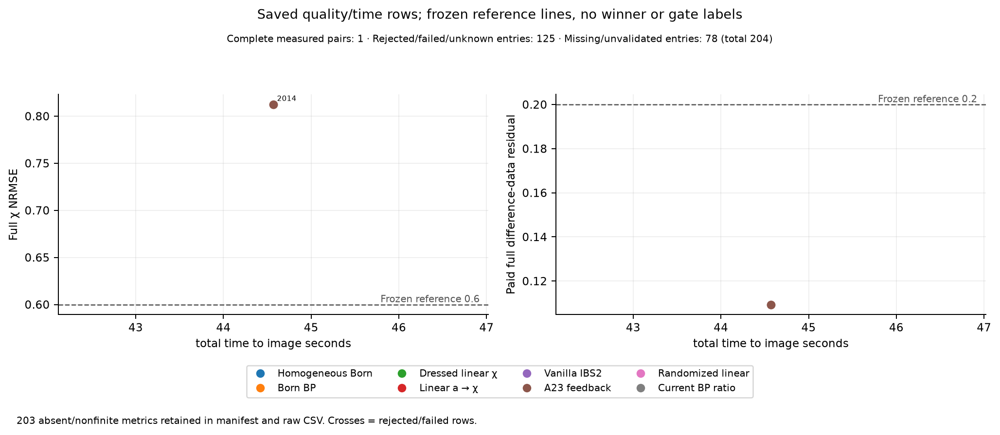

# A23：完整材料空间中的 Maxwell 少次反馈成像——首轮真实数值实验

研究日期：2026-10-08。固定预算、四个历史暴露场景的三维矢量 Maxwell pilot。**H1 FAIL；H2 FAIL；H3 FAIL；STOP_NO_EXPANSION。**

仓库：[migodam/a23-fast-material-imaging](https://github.com/migodam/a23-fast-material-imaging)。匿名全文：[raw 中文报告](https://raw.githubusercontent.com/migodam/a23-fast-material-imaging/main/A23_RESEARCH_REPORT_ZH.md)。实际来源见 [运行 manifest](A23_RUN_MANIFEST.json) 和 [pilot source snapshot](RUN_SOURCE_SNAPSHOT.json)。

## 1. 背景：编码、成像和成本是三个不同的问题

逆散射面对信息不足：有限源和接收通道测到的是材料诱导电流传播后的响应，不直接给出每个 cell 的复材料值。OPM 将观测、入射传播、材料扰动分别放入 O/P/M 通道，再通过 Schur feedback 构造低维电流表示。它是否有实用价值，需要同时检验：是否删去重复计算、是否改善完整材料图像、额外准备是否在真实 time-to-image 中回本。

A20–A22 提供了可复用的物理资产，但不能把旧结果直接移植成新的成像结论。A21 是 oracle frozen-GN anatomy；A22 的固定32D chart只包含部分对象能量。这里使用全部 cells 的实材料质量坐标，已知背景作为参考点，旧 chart只用于离线解释。实施前理论包已经完成，本实验没有重新推导理论或在看到结果后寻找新的score。

预先冻结的科学门槛：

- **H1 计算最小性：**同 transfer error≤5% 时，完整 encoder准备成本下降≥20%；或同完整准备预算下 decoder-weighted error明确改善。
- **H2 成像收益：**nominal t=1 的zero和20dB条件，在至少两个不同形状家族上，相对最强同prior线性对照的full material NRMSE均下降≥10%，且材料可行。
- **H3 成本收益：**full χ NRMSE≤0.60、材料可行且真实差分data residual≤0.20的共同质量区内，完整时间下降≥20%，或同完整成本产生更优非支配点。

门槛和汇总在候选质量输出前写入 [FROZEN_CONFIG.json](FROZEN_CONFIG.json) 与 [汇总冻结规则](configs/SCIENTIFIC_AGGREGATION_FREEZE.json)。失败、拒绝、未验证输出保留。没有通过删除失败行、变更prior/degree或隐藏projection让门槛通过。

## 2. 冻结来源、真实物理和信息边界

后端来自 `migodam/a20-opm-imaging@b85a29a51f4ea7b4d93617e827d88e23933b89df`；A22 handoff pin为 `4dd4a9fa69d4272f35a6b93d8455f77cb139187b`。`src/a20` 与 A17 `DenseDDA` 保持冻结。A23新增完整材料接口、编码/解码、pilot、预算guards和报告。实际pilot源码为 `8e7d8cf209c6e54f55567b940658e1742aa4cc55`；后续报告/缓存诊断没有改动原始物理实验输出。

| 项目 | 固定设置 |
|---|---|
| 物理 | 三维dyadic Green、CM/RR极化率、DenseDDA；未重写solver |
| 网格/材料 | 12³=1728 cells；3456实质量坐标；v=(1.5/12)³ |
| 电流 | 每源5184复分量，c=j/√v |
| acquisition | 六illumination；64receiverpositions，每源128复通道 |
| 数据 | 每源`[Re128,Im128]`，逐源stack，共1536实维 |
| 频率/参考 | k=2；已知χb=0.1+0.04i；各场景冻结旋转 |
| 精度 | complex128 / float64 |
| OPM | U8/O4/P4/M4，degree1；原实际current rank32 |
| 压缩 | randomizedtransfer rank32；quadraticdata rank32，32Gaussianprobes+8holdouts |
| prior/λ/γ | 完整材料isotropic physical L2；λ=10⁻³σmax(Aref)²；γ=1 |
| 可行性 | Reχ≥−0.5、Imχ≥0；检查容差与inversepole floor均10⁻¹⁰ |
| 求解 | analytic Tikhonov后显式拒绝；无clip、隐藏projection、jitter、pinv或fallback |

对象2001（较弱Gaussian）、2003（较强Gaussian）、2014（非对称分段材料）、2009（多尺度shell）均为历史暴露对象。四场景才是独立统计单位；204方法/噪声/幅度行不是204个独立对象。

旧A22 clean数据生成网格为14、solver材料网格为12，不能充当同backend标签。本次按预注册额度生成4×3=12个新clean多源fullstates，没有更换对象或增加家族。源/接收旋转逐场景不同，禁止跨geometry误复用workspace。

在线可读已知几何、背景、背景场/J/receiveradjoint、冻结decoder、测量和噪声模型；在线禁止truth、truth-state J/H、full-GN optimum、旧oraclecurrent、依据truth选rank/γ。离线label/evaluator单独持有truth。truthdirection曲率、旧chart投影明确标为 **OFFLINE DIAGNOSTIC ONLY**。已知背景的full J是参考物理算子，不是未知truth-state oracle。

## 3. 实现公式、先验和强对照

原物理为 `j=a(χ)(e_inc+Gj)`，`L=I−aG`。χ扰动不等于bareχforcing；二阶不能漏掉局部constitutive项。原极化率为

\[
a=\frac{3v\chi}{3+\kappa\chi},\quad
a'=\frac{9v}{(3+\kappa\chi)^2},\quad
a''=-\frac{18v\kappa}{(3+\kappa\chi)^3}.
\]

材料坐标 `x=√v[Reδχ,Imδχ]`。缓存receiveradjoint `Z=L_b^{-*}S*`，按源流式收缩 `A_s=Z*B_s`，不分配current×material大Jacobian。`Qχ`包含Hessian的一半，分为传播feedback及local a″项。一次反馈为

\[
x_1=D(y-y_b),\qquad x_2=x_1-D\widehat Q_\chi(x_1,x_1).
\]

Vanilla IBS2用完整Q；A23使用同D、同x1、同γ，只把Q输出投影到固定rank32 Gaussian quadratic data space。Gaussian训练均值保留，training/holdout独立，不形成full p² tensor。

`linear_a_exact_conversion`以背景点 `h=a'_bδχ` 的pullback坐标采用同一D，再做精确a→χ转换。强幅度下只建立局部prior匹配，不声称全局非线性概率密度等价。这一对照防止把坐标转换误认为额外feedback信息。

| 方法 | 用途 |
|---|---|
| homogeneous Born、Born BP | 普通线性与反投影对照 |
| dressed linear χ | 背景full transfer的完整材料Tikhonov |
| linear a+exact conversion | constitutive坐标转换强对照 |
| vanilla IBS2 | 未压缩二阶机制对照 |
| A23 compressed feedback | 主候选；固定quadraticdata rank32 |
| generic randomized linear | 固定rank通用transfer sketch |
| current BP/material ratio | 简单电流→材料成像对照 |

Tikhonov和feedback各臂共享同物理prior及冻结λ；BornBP使用σmax(BornA)²解析归一，currentBP/ratio使用其预注册解析公式，不在公式中使用λ，也不依据truth调参。全部方法共享几何和noise realization。合理CSI/DBIM、iterativeGN、独立discretization/频率未运行，因此不声称击败它们。

## 4. 验证与执行顺序

顺序为 tiny/unit→fullsize microbenchmark→H1八臂→H2/H3固定矩阵→cached-only诊断/报告。H1数值一致性通过后，在同一已冻结pilot内完成H2/H3机制判别；没有把H1工程identity当科学PASS，也没有因负结果扩大矩阵。

两份随包tiny verification通过；实际冻结adapter、realadjoint、χ/a二阶、sourceanchor、cachedSchur、gauge、错误路径和budget/cacheguards共 **50项测试通过**。tiny实际物理测试为8cell，和完整1728cell图像分开。

fullsize micro给出source residual 4.79×10⁻¹⁵、streamed/paid tangent差6.26×10⁻¹⁵、realadjoint dot error3.76×10⁻¹⁵、Qsymmetry error7.64×10⁻¹⁶；其余场景的所测identity也通过。micro剩余工作预测约1474秒，满足预算才启动矩阵。

保留首次phase0 import失败及一次FDprobe步长导致的测试失败。后者采用独立固定per-test RNG和明确ε²回归修正测试设置，未改物理或放松生产门槛。两次pull的metadata/独立failureledger冲突只修正导出流程，没有重跑Maxwell。完整记录见 [失败账本](results/a23/FAILURE_LEDGER.jsonl)、[冲突说明](PROTOCOL_CONFLICTS.md)、[传输审计](docs/A23_TRANSPORT_SUMMARY.md)。

## 5. H1：恒等式成立，完整计算最小性FAIL

cached Schur用既有FU/F*U构造C/CH，与原式/transfer差约10⁻¹⁴至10⁻¹⁵。确实删去重复算子调用，但reference、receiver、basis、transfer及导出仍占主要准备成本。

下表为8个独立fullmaterialprobes的transfer error与**完整cold encoder**，含所需reference/receiver准备、encoder和cacheexport，不含独立评价probe/共同评价decoder。

| scene | 原OPM error | 原OPM秒 | cached秒 | cached降幅 | source-anchor OM error | directadjoint秒 |
|---|---:|---:|---:|---:|---:|---:|
| 2001 | 5.462% | 12.331 | 12.226 | 0.857% | 9.673% | 12.832 |
| 2003 | 6.152% | 16.429 | 16.362 | 0.408% | 10.412% | 16.818 |
| 2014 | 4.864% | 14.995 | 14.943 | 0.350% | 9.905% | 15.526 |
| 2009 | 4.938% | 14.684 | 14.594 | 0.618% | 9.876% | 15.024 |

完整32行和cold1/warm5、RHS/rank见 [H1_SUMMARY.csv](results/a23/H1_SUMMARY.csv)。directadjoint是精确transfer控制组；其完整cold已经加约4.7–4.9秒真实独立构造，不把0.16秒cachecopy当完整准备。它略慢于OPM，未产生20%下降。

sourceanchor把六源参考current span放入U后，`Kb_s`相对原forcing约5.7–6.2×10⁻¹⁵，P为结构零。按全forcing尺度判断，effective P rank0，不让自身微小尺度的roundoff产生P6。U改为6source+2receiver，原U为8receiver；最终OPM/OMrank24、MPrank24、M-onlyrank16。比较同时改变retainedallocation和actualrank，不能据此宣称“P intrinsically必要”或“删除P总是无损”。

sourceanchoredOPM和OM一致，error约9.7–10.4%；MP约10.8–11.7%、M-only约24–25%、randomizedtransfer约9.6–11.7%。RHS减少没有保持要求的fidelity；同预算decoder也无明确改善。

**裁决：**cachedidentity/source-P冗余得到验证，完整同质量成本门槛未通过。H1 FAIL。cachedSchur可以保留为工程改进，不能据此主张新成像机制。

## 6. H2：全材料收益未跨越强对照与物理门槛

12cleanlabels形成24主观测，每观测8方法，共192行。nominal20dB的σ固定为t=1差分RMS的10%，各t同σ；复噪声实/虚方差各σ²/2。因此t=.15的有效SNR更低，不称为同有效20dB。

主指标为全cell质量范数fullχNRMSE；δχ、实/虚、edge/support、小固定几何区域和材料违例分别保存。以下为t=1 noisy的**原始**fullχNRMSE（%），拒绝输出保留：

| scene | dressedχ | lineara→χ | generic32 | IBS2 | A23 | A23状态 |
|---|---:|---:|---:|---:|---:|---|
| 2001 Gaussian | 42.588 | **41.816** | 46.529 | 41.973 | 42.752 | REJECTED |
| 2003 strongGaussian | 56.736 | 63.698 | **55.536** | 42.575 | 52.306 | REJECTED |
| 2014 asymmetric | 81.241 | **81.166** | 81.894 | 81.210 | 81.237 | OK |
| 2009 shell | 73.011 | **71.157** | 77.012 | 72.102 | 72.738 | REJECTED |

粗体只表示最强原始匹配线性error，不表示可行或winner。完整表同时列原始与合法线性最强对照，包含BornBP。已修正汇总器漏列BornBP的报告缺口：8个条件的合法对照恢复、1个低幅度条件rawbest变更；所有nominal主条件rawbest及H1/H2/H3结论不变。没有改算法、阈值或原始实验。

| scene | A23对最强线性改善：zero | 改善：noisy | 两条件均≥10%且可行 |
|---|---:|---:|---|
| 2001 | −2.510% | −2.238% | 否 |
| 2003 | +7.824% | +5.817% | 否 |
| 2014 | −0.092% | −0.088% | 否 |
| 2009 | −2.240% | −2.222% | 否 |

2003未压缩IBS2 raw改善约26.6%/23.3%，edgeerror从0.948降至0.793。这是局部二阶信号，但noisy imaginary NRMSE仍2.455，材料不合法，且无第二家族。IBS2机制对照同样H2 FAIL；A23也损失了这一局部headroom。

2014/2009 A23 noisy supportIoU分别0/0.098，edgeerror0.998/0.966，没有恢复分段细块和shell边缘。切片采用统一truth-volume色阶；红/黄显示超范围原值，不裁剪重建。

**裁决：**A23没有跨两个家族提供≥10%改善，多数主预测材料拒绝。H2 FAIL。constitutive精确转换在部分场景比A23更有用，这不等于新增feedback信息。

## 7. 失败机制：有限幅度、压缩、欠定材料

### 7.1 二阶数据响应不等于新的可恢复材料维度

truthdirection曲率属于OFFLINE，只解释失败，不参与编码/rank/γ选择。t=1的背景归一数据范数如下：

| scene | finite−linear | fullQ | feedbackQ | locala″ | finite−linear−Q | λ定义稳定rank |
|---|---:|---:|---:|---:|---:|---:|
| 2001 | 1.832 | 2.026 | 2.182 | 2.512 | 0.214 | 48 |
| 2003 | 28.909 | 33.772 | 39.789 | 34.483 | 6.879 | 46 |
| 2014 | 3.074 | 4.846 | 1.176 | 5.390 | 1.792 | 48 |
| 2009 | 7.655 | 10.951 | 7.748 | 16.202 | 3.329 | 48 |

local和传播项可以抵消，不能相加范数冒充fullQ。强Gaussian/shell在nominal幅度的三阶及以上余项明显，一次二阶correction没有有限幅度保证。

fullreference tangent数值行秩1536，与数据维数相同；Q在其正交complement的相对范数约2×10⁻¹²。这里没有发现fulltangent之外的数据维度。稳定tangent仅46–48维，其complement、旧32chartcomplement、nuisancecomplement是不同对象，不能混称新Maxwell信息。原nuisanceaudit为6sourcegains+128observedcomponentgains、rank133，比stress中的64receivergains（每receiver两分量共享）更大；它是OFFLINE per-componentgain诊断，不是该stress的精确tangent。

材料维度3456大于数据维数1536；满数据行秩不意味着材料唯一或稳定可逆。D A不是完整材料恒等；理论包的精确leftinverse局部高阶结论不直接适用于本Tikhonov全材料求解。全局rigorous反馈范数界未计算，原表仍 `NOT_COMPUTED`，只报告empirical余项。

### 7.2 固定rank32输出压缩未保留一般二阶响应

Gaussian训练均值在实际Uy中保留到1.15–1.58×10⁻¹⁵；这排除了“漏均值”错误。8holdout投影相对误差约0.47–0.76，各场景均值0.614–0.643，并非小扰动。不能只展示压缩速度。

同D/x1下，材料correction `c_full=x1−x_IBS2` 与 `c_comp=x1−x_A23` 的cached-only对比如下，relativedeviation用 `||c_comp−c_full||/||c_full||`，不冒充数据Qcapture：

| scene t=1 noisy | correction相对差 | materialcosine | A23违规Re/Imcells |
|---|---:|---:|---:|
| 2001 | 1.110 | 0.367 | 0 /89 |
| 2003 | 0.813 | 0.615 | 9 /577 |
| 2014 | 0.966 | 0.581 | 0 /0 |
| 2009 | 0.948 | 0.576 | 0 /269 |

它直接显示compressedcorrection偏离未压缩correction，尤其强Gaussian差异不能归到不同optimizer。以上仅从保存数组/小矩阵重算，没有新Maxwell或labels；见 [缓存诊断](docs/CACHED_DIAGNOSTICS.md)。

### 7.3 材料可行性和不适定性仍然主导

冻结analyticTikhonov+explicitrejection没有保证材料合法。125/204行拒绝是rawimage违例，不是Maxwellsolver崩溃。不能事后clip负吸收或换新constrainedoptimizer替换旧结果。

2014唯一合法keyprediction的fulldataresidual约10.9%，但图像误差81.2%、δχerror96.1%、supportIoU0。数据拟合与图像质量必须分开。稳定方向少、L2prior对细结构分辨不足、有限幅度余项和输出压缩共同限制此次pipeline。此证据否定固定配置的强收益，不证明所有feedback/OPM成像都不可能。

## 8. H3：decode局部节省，没有完整部署证据

固定12keychecks为dressed/IBS2/A23×四场景t=1 noisy。11个材料检查拒绝，未继续为不合法预测支付fullsolve。只有2014A23完成：

| 指标 | 实测 |
|---|---:|
| fullχNRMSE | 0.812370 |
| δχNRMSE | 0.961217 |
| full nonlinear difference-dataresidual | 0.109364 |
| 完整独立归因coldtime | 44.569881秒 |
| 共同质量门槛 | FAIL：图像误差>0.60 |

A23的Gaussianquadratic训练+holdout准备约15.5秒/场景；dresseddecode约0.01秒，IBS2约0.57–0.59秒，A23约0.39–0.40秒。feedbackdecode约30%节省不能消除新增准备，更不能替代同质量completecomparison。真实shared支出只付一次；各method独立deploymentattribution分别支付自己的reference/setup。

Pareto表保留拒绝/未验证/null行，未用surrogateresidual代替fullresidual，未填0时间。共同质量区没有可认证主候选点，H3 FAIL；其他未full验证方法的部署性能保持未确立。

cold1/warm5真实decode、转换、可行性均测量；fullprediction每key只一次。warmcompletepipeline为NOT_RUN，N10/N100是公式外推。没有rank降维即加速的主张。

## 9. 鲁棒性、旧chart和统计限制

source5%amplitude/receiver3%gain的固定物理关联扰动复用cleanlabel及pairednoise，4观测×3方法=12行，全部材料拒绝。baseline/A23可选八个fullchecks也全在材料处拒绝，没有新增labels。geometryheldout、multifrequency、独立discretization没有跑。

old32chart只作OFFLINE，其正交/能量分解检查通过1e−9：

| scene | truth δχ能量在旧32chart外 |
|---|---:|
| 2001 | 53.509% |
| 2003 | 51.020% |
| 2014 | 94.235% |
| 2009 | 86.627% |

本次fullimage输出没有被chart限制；旧chart外能量不能被算成某个chart内priorbranch失败。完整204行分解见 [CHART_DIAGNOSTICS.csv](results/a23/CHART_DIAGNOSTICS.csv)。所有家族仍历史暴露，noise/amplitude重复不作为独立objects，没有用小样本统计制造正式PASS。

## 10. 预算、动作和失败

GPU硬上限7200秒，累计含作业尾部 **1628.925567秒=27.15分钟**。发布前刷新全部终止receipt后，无orphan/active作业。CPU已知实测下界1597.412秒，保守预算charge1628.447秒（含未精确测量小项的allowance）；发布的额外实测费用继续入账，以最终 [COST_SUMMARY.json](results/a23/COST_SUMMARY.json) 为准。未知精确CPU不伪装成测量值；allowance是保守剩余开销覆盖，不是精确30秒实际消耗。

| 大尺寸状态 | 次数 /六源RHS | 说明 |
|---|---:|---|
| reference | 9 /54 | micro1、H1四、pilot四；provenance重建也收费 |
| cleanlabel | 12 /72 | 达到冻结12上限 |
| prediction | 1 /6 | 11primary、8calibration检查材料拒绝 |
| 总计 | **22 LU /132fullstateRHS** | tangent/adjoint/Schur/receiver/QR/SVD另计 |

production forwardsolve RHS8424、adjointsolve RHS3712；F/F*、L/L*、B/B*、S/S*按类公开。`full_tangent_RHS`、`Maxwell_matvec_rhs`和alias/嵌套span不重复求和。123个tinyCPU模型LU独立列示，不混成大尺寸state。

主结果204行：79OK、125REJECTED_PHYSICAL；fullvalidation 1RUN、19REJECTED、184NOT_RUN。19prediction拒绝已经对应125行内的image，不重复宣称为额外独立重建失败。failureledger同时保存candidate/validation/代码失败，各scope可追踪。

早期tiny内部vectorcounts没有全部序列化，unitactioncoverage明确partial；production终止CPU/GPU及动作保存。GPU余额没有用于扩展，因为固定矩阵完成且gates失败。

## 11. 理论、实现、物理与online证据分层

| 类别 | 实际交付 | 支持范围 |
|---|---|---|
| 实施前理论 | 条件定理、Schur/sourceanchor、relativefeedback、反例/复杂度 | 数学条件；不是全材料逆问题成功 |
| identity/unit | 两tiny验证、50tests、fullsizeadjoint/streaming/sourcechecks | 所测实现一致；不是图像PASS |
| 真实Maxwell | 四场景12labels、H1八臂、204images、1合法fullprediction | 固定regime负结果；非blind/clinical/独立modelvalidation |
| OFFLINE | truthdirection曲率、full/stable/oldchart/nuisance分解 | 解释失败，未回送runtime选参数 |
| 合法online | 背景encoder、冻结D/γ、测量→完整材料、可行性检查 | 原方法可行性与独立setup归因；缺full验证不补造 |

全部公开代码、配置、seeds、CSV/NPZ、终止receipts、失败、成本和图表rawtable已保存。部分早期phase0/micro/H1的A23 source_snapshot缺失，不反推未记录commit；后期phase0/pilot有实际源码snapshot。理论包原验证与本次重跑分别保留。约3.15GBderivedworkspace保留原运行环境，未打包；生成代码、合法输入和probebank公开可复现。fullp²tensor没有生成，第三方全文/个人账号/密钥未公开。历史hash保留历史，不重新SHA256检查。

## 12. 最终判断与下一步建议

H1的工程恒等式成立、成本gateFAIL；H2完整材料/强baseline/跨家族gateFAIL；H3同质量completecostgateFAIL。当前固定fullcellL2、一次feedback、rank32压缩pipeline不值得直接扩大NN、rank、degree或GPUcampaign。保留背景directtransfer和完整负证据，**停止OPM专属扩展**。

如果未来继续，需要另立预注册问题：在明确材料可行域和同等强prior下，哪些fullmaterial尺度可靠可恢复，物理约束求解能否保留未压缩IBS2在强Gaussian的局部headroom。该建议不是自动执行授权；本次不换solver救图，不训练NN、不扩大实验。

公开发布与科学GO/NO-GO分开。复核入口为 [EVIDENCE_INDEX.md](docs/EVIDENCE_INDEX.md)、[REPRODUCE.md](docs/REPRODUCE.md)、[gateJSON](A23_GATE_DECISION.json)。原理论README保留为 [THEORY_PACKAGE_START_HERE.md](THEORY_PACKAGE_START_HERE.md)，其中“尚未实现”是历史状态。本报告和实际receipts是本次实测结果。
